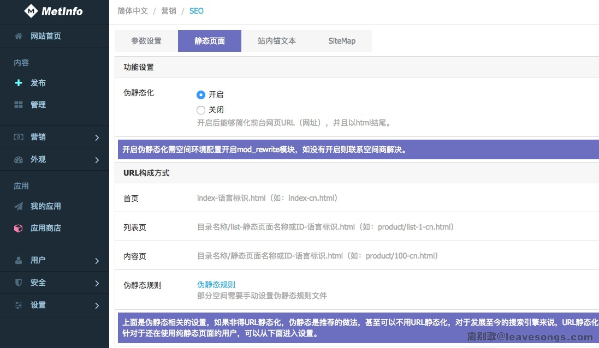
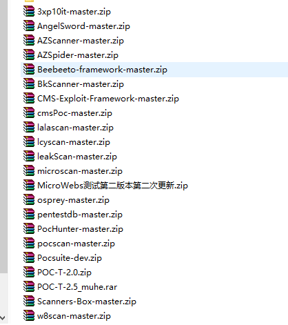

# 解读PoC框架——鱼鹰osprey

Osprey是由TCC(斗象能力中心)出品并长期维护的开源漏洞检测框架

## 简介

Osprey——鱼鹰，一种善于捕鱼的猛禽，取此命名漏洞盒子PoC框架，寓意快、精、准。

Osprey是一个可扩展的开源漏洞检测与利用框架(Python3开发)，是TCC长期的安全能力与经验的积累形成的一个可用工具，目前被集成应用于企业级安全产品 [`网藤风险感知-CRS`](https://www.riskivy.com/product/crs) 中。 Osprey框架可供使用者在渗透测试、漏洞检测、漏洞扫描等场景中应用。框架提供了命令行接口和Web接口，可供灵活调用，也可用于构建自己的扫描器。

官方介绍文章：

`http://www.freebuf.com/news/151593.html`

## 下载源码

源码地址：

`https://github.com/TophantTechnology/osprey`

本人下载时间是2017年12月18号。

## 目录结构

下载之后解压，可以得到下面的代码。

```bash
osprey
│  BasePoc.py # poc格式模板类
│  config.yaml # poc配置文件
│  osprey.py # osprey 命令行起始文件
│  README.md
│  requirements.txt # python3 安装模块
│  settings.py # 全局配置文件
│  setup.py # 构建工具，python setup.py install安装
│  utils.py # 常用函数
│
├─console
│      osprey-console.py 
│      __init__.py
│
├─core
│      PocManager.py # 加载poc、调用执行poc
│      RunPoc.py # 执行poc
│      __init__.py
│
├─doc # 说明文档
│      PoC_specification.md # poc说明文档
│      web_api_tutorial.md # api说明文档
│
├─docker # docker部署相关文件
│      docker-compose.yml # dock-compose 执行文件
│      dockerfile-osprey
│      osprey-web.png
│      start-osprey.sh
│
├─lib
│  │  log.py # 日志相关
│  │  payload.py # http的header内容
│  │  requests.py # 处理请求包和返回包
│  │  __init__.py
│  │
│  └─core
│          cmdparser.py # 命令行参数解析文件
│          config.py # poc配置文件的加载
│          datatype.py # \lib\core\prepare.py中fb的输入参数格式
│          db.py # 数据库操作文件
│          display.py # 扫描结果处理
│          gevent.py # 多线程相关
│          prepare.py # 将输入的参数options装到指定格式的fb中/处理请求、代理
│          req.py # 处理请求的格式
│          __init__.py
│
├─pocs # poc文件
│      vb_2017_0060_Metinfo_5_3_17_X_Rewrite_url_Sql_Injection.py # metinfo的注入漏洞PoC
│      __init__.py
│
├─thirdparty # 第三方模块
│
└─web # api/web相关
    │  check.py # 输入参数检查
    │  osprey-web.py # api启动文件
    │  requirements.txt
    │  SubProcess.py # 子进程
    │  task.py # 组装命令行，执行子进程
    │  __init__.py
    │
    └─static # flask的web页面目录
            index.html # api说明页面
```

## 搭个环境先

要poc跑通的话，poc的漏洞环境必不可少。我们可以看到`vb_2017_0060_Metinfo_5_3_17_X_Rewrite_url_Sql_Injection.py`这个是metinfo的sql注入漏洞。这个漏洞是对小于5.3.17的版本有效的，经过测试，发现5.3.17不行，用5.3.16可以。所以我这里是用5.3.16。

相关的分析文章可见phith0n的文章：`https://www.leavesongs.com/PENETRATION/metinfo-5.3.17-sql-injection.html`

注意主要条件就是，需要管理员开启伪静态喔。



## 命令行执行

代码主要执行过程：

osprey-->


## API

代码执行过程：


## 源起

大家好，我是木禾。上个月，即11月，想自己写个poc框架，于是到到处找各种PoC框架，看遍了github上力所能及的相关框架代码。放个图就知道我看了多少了。




看了osprey的源码，觉得还蛮不错的，可以学习学习，看了两个星期吧。写了这篇文章，有什么错误的地方，请直接喷。

真的很感谢有分享精神的人，有了这些已有的代码，才能在此基础上做更多的思考，更深入地发掘。作者本人也非计算机相关专业出生，代码全靠兴趣，能够学习有所进步也得益于看别人的代码。优雅的代码，让人享受。

目前我是基于osprey，写了一个可以兼容osprey/beebeeto/angelsword/pocsuite/TangScan/KSPoC等PoC的框架，还可以兼容python2和python3的代码，同时亦通过组件的形式可以无限扩展。^ ^，还在调试，代码过一段时间再公布出来吧。